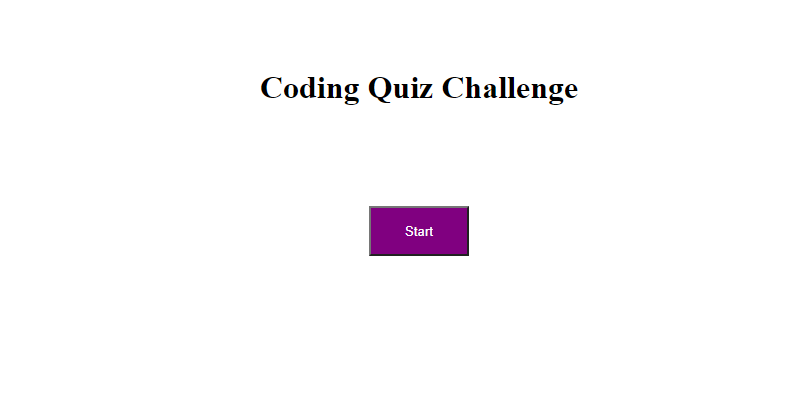

# Quiz-Game

[Link to Project](https://jaredc71.github.io/Quiz-Game/)
##### Put your coding knowledge to the test!! This application
##### was built using HTML, CSS, and Javascript. When the user
##### plays, a timer starts. If a user gets the question wrong,
##### the timer is subtracted by 10. At the end, the user can save
##### their score!